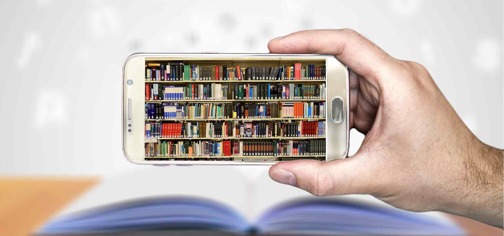
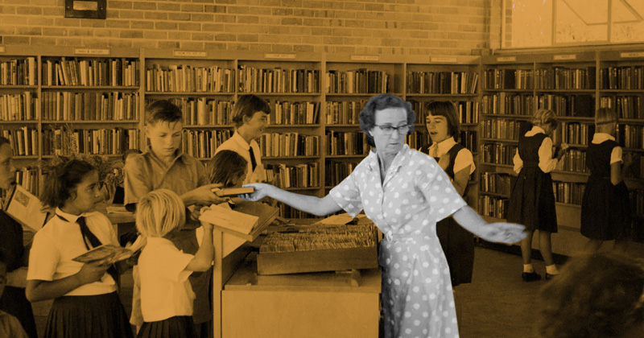
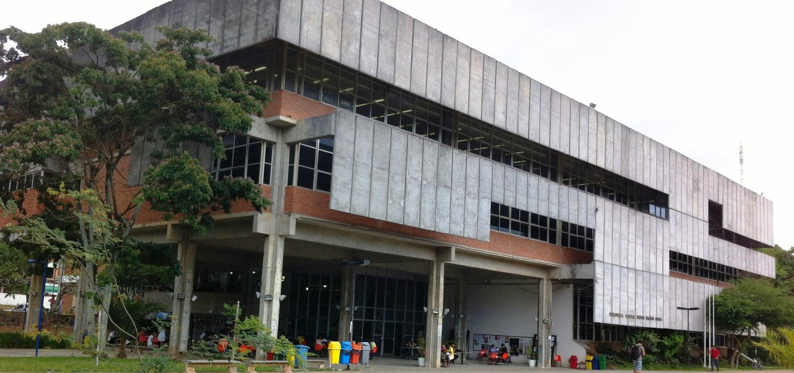
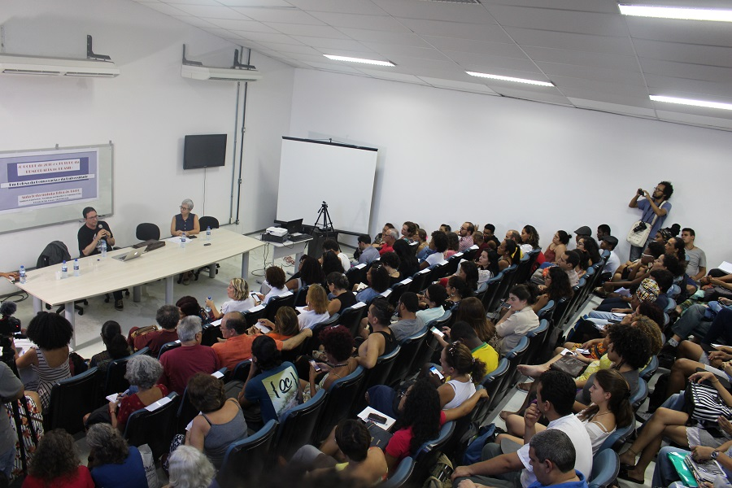

```{r setup, include=FALSE}
knitr::opts_chunk$set(echo = FALSE)
```

# As bibliotecas universitárias


# Quais os efeitos da web e da digitalização dos acervos?




# 

> "O meio é o método"


# As bibliotecas universitárias


# O paradoxo do acesso universal 

- O novo meio digital pode enfim assegurar o ideal alexandrino mesmo numa versão propensa a incorporar um conjunto de dados desordenado e de uma variedade espantosa de bens, serviços e idéias.


<br>

- O que é importante? O que é útil? O que é verdadeiro?


#

> "Quais seriam os conteúdos da biblioteca eletrônica virtual? Tudo? "Tudo" o quê? A simples formulação dessa pergunta já evidencia que uma das funções mais valiosas da biblioteca tradicional não reside em seu caráter inclusivo, e sim em sua exclusividade, em seu juízo discernidor que deixa de fora tanto quanto nela se guarda" (Avatars of the World - James J. Donnell)


# As bibliotecas universitárias





# Qual o destino das bibliotecas enquanto espaços físicos?





# "...além da 'indústria da informação', uma 'indústria do conhecimento'";


# Qual o futuro dos professores?


- "Há quem acredite que os professores logo perderão seu poder, pois os alunos terão acesso imediato a tudo o que eles sabem";

<br>

- "grande parte do software educacional será excelente e de fato superior às aulas ministradas por mestres que proliferaram desde a criação da primeira universidade";


# + economia, velocidade, conforto e liberdade???

- "A internet dispensará os estudantes de viajar longas distâncias"; 

<br>

- "A informação se espalhará mais depressa do que incêndios em florestas";

<br>

- Cursos mais curtos, menos intensidade;

<br>

- Dimuinuição das fronteiras (níveis e pós-graduação)

<br>


# O que a presença física nos proporciona?

- Wittgenstein: "conhecimento-para" (conhecimento de proposições) e "conhecimento-como" (conhecimento fruto da interação) 


{width=65%}

#

> "Precisamos estudar **com urgência** como utilizar as novas tecnologias, que investimentos em infra-estrutura e desenvolvimento de software se fazem necessários e de que modo a mais recente tecnologia de videoconferência pode ampliar e intensificar
a interação entre universidades, a fim de aperfeiçoar os programas e diminuir seus
custos."


# Quanto "vale" um diploma?


- "a presente estrutura de diploma ainda é 'medieval'";

<br>

- Como o mundo se adaptaria à ausência de garantia de uma formação "superior" por parte da universidade?


- Se os empregadores não pudessem mais presumir, ao menos como uma ficção conveniente que um diploma atesta certo conhecimento os custos não se justificariam;

<br>

- "Nossos diplomas parecem atestar uma competência cada vez menor".

<br>


# Quais as qualificações mais importantes garantidas pelo diploma superior?


1. "habilidade de utilizar a razão para ver com mais clareza" 

<br>

2. "pensar criticamente e de escrever de forma clara" 

<br>

3. "Para pensar criticamente, é preciso dominar o uso das ferramentas do pensamento e da análise, tais como a lógica e o método científico. 

<br>

4. Para isso não se pode deixar para trás a organização prévia do conhecimento e a constante
avaliação das informações novas, avaliação esta que é atualmente tarefa das universidades.


# O fim da Universidade?

> Se os empregadores deixassem de ver os diplomas universitários como índices de aptidão para o trabalho, as universidades talvez não fossem mais vistas sobretudo corno fornecedoras de credenciais


# Universidade como agente de mudanças

> "Isso se deve em parte aos valores que a verdadeira universidade preza acima de tudo: liberdade
(não só a acadêmica), não-discriminação (todos serão ouvidos independentemente de sexo, raça, etnia e religião) e igualdade de oportunidade"


#

> "Um mundo em que permanecer de pé, imóvel, significa cair" (p.51)

# Responsabilidade

> "todas as universidades terão de adotar estruturas administrativas que valorizem a responsabilidade em todos os níveis."

# 


Obrigado!
(Dúvidas, perguntas?)
